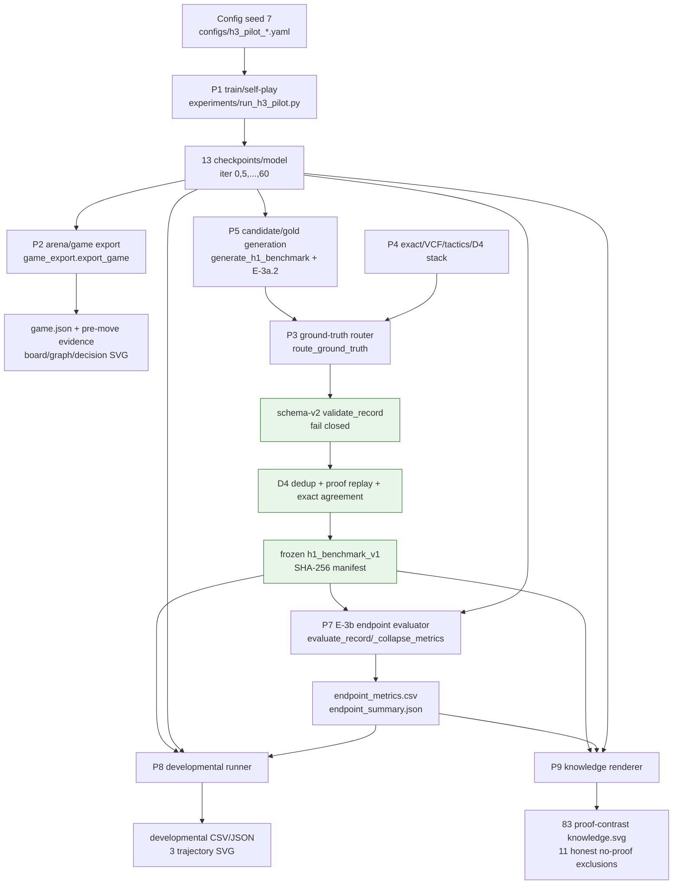

# PAPER-READINESS AUDIT

Ngày kiểm kê: 2026-08-14 
Phạm vi: trạng thái working tree hiện tại; chỉ đọc code/artifact, không chạy lại train, self-play, solver, evaluator hay test. File này là đầu ra duy nhất của audit. Mọi số dưới đây được chép từ artifact được nêu; khi repo chỉ có báo cáo mà không có log gốc, audit nói rõ.

## Tóm tắt điều hành

Repo đã có một chuỗi bằng chứng đủ rõ để dựng draft của một **empirical/negative-result paper về interpretability**: trên benchmark Gomoku 6×6/k=4 đã đóng băng, R-GAT học được competence nhưng attention không vượt random/structural proof alignment; developmental trajectory cho thấy hiện tượng này còn tồn tại ở đuôi hội tụ sau khi hard-collapse biến mất. Đây là kết quả tương quan trong một domain toy, một training seed, không phải bằng chứng nhân quả và không phải paper về “graph model chơi cờ mạnh hơn”.

Nguồn bất biến trung tâm là `diagnostic/h1_benchmark_v1/h1_benchmark_v1.jsonl`, SHA-256 `9abd52ef4991489586682e881e495fcb4c2ffe00fb55dc9dee1d9008aca4ff02`, n=94 (23 mid, 71 late), 83 state có proof, 243 proof replay-pass. Endpoint dùng iter 60 của hai model; developmental dùng 13 checkpoint/model. Các claim chính đủ số nhưng phải giữ scope late-game 6×6 và ngôn ngữ tương quan. Causal ablation, MCTS-budget ablation, arena có CI, nhiều training seed và complete metrics bàn lớn đều **CHƯA ĐO**.

## P. Pipeline inventory

### P0. Sơ đồ luồng thật

Các cổng soundness nằm ở: validator schema-v2 (`azgomoku/h1_schema.py:74`), certificate replay (`azgomoku/vcf.py:216,297`), gold reader fail-closed (`investigation/e3b_common.py:42`), proof replay/annotation (`investigation/e3b_common.py:89,129`), exact freeze agreement (`investigation/e3b_pipeline.py:109`), graph/D4 gate (`investigation/e3b_graph.py`; artifact `results/h1_integration/e3b/graph_gate.json`) và điều kiện freeze chỉ khi cả gate pass (`investigation/e3b_pipeline.py:363-369`).

### P1–P9: entry point, I/O, cổng và versioning

| Pipeline | Entry point và điểm nối thật | Input bất biến / tham số | Các bước và output thật | Cổng | Versioned? / vai trò reproduce |
|---|---|---|---|---|---|
| P1 Training/self-play → checkpoint | `experiments/run_h3_pilot.py:34` gọi `azgomoku.training.self_play` và `train`; model ở `models/rgcn.py`, `models/rgat.py`, graph encoder ở `azgomoku/graph.py` | Hai config `configs/h3_pilot_rg{cn,at}.yaml`: 6×6/k=4, seed 7, 60 iter, 20 game/iter, 50 MCTS playout, 8 update/iter | Self-play → symmetry augmentation/replay → optimize → checkpoint. Mỗi model có 13 checkpoint `iter_000.pt`…`iter_060.pt`; manifest ghi 1,200 game và 480 updates tại iter 60. Output `results/h3_pilot_v2/{rgcn,rgat}/seed_7/` | Checkpoint bundle lưu model/optimizer/replay/RNG; test tương ứng `tests/test_h3_infrastructure.py`, collapse controls ở `tests/test_collapse_controls.py` | Run path có model+seed và checkpoint iteration; manifest `format_version=1`, nhưng không có content hash từng checkpoint trong manifest. **Phụ trợ** cho tái tạo kết quả đã có; training lại không cần để chấm artifacts frozen. Chỉ tìm thấy **một training seed thật: 7**, cho cả hai model. |
| P2 Arena/game generation | `azgomoku/explanation/game_export.py:48 export_game`; `select_action` được generator P5 import tại `investigation/generate_h1_benchmark.py:16` | Checkpoint, model/opponent, MCTS playouts, `base_seed`, `game_index`; `game_seed` tạo seed-per-game | `mode=eval` chọn argmax visit; `mode=data` sample từ visit distribution theo temperature. Mỗi ply dùng pre-move state, MCTS, evidence; output `game.json` + per-move `explanation.json`, board/graph/decision SVG | `tests/test_game_export.py`: hai mode, deterministic game seed, second model, continuous state IDs, manifest | `game.json` có `schema_version=1`, mode/settings/seed/checkpoint path. Repo có ba directory 5-game data; canonical/reportable set `results/h3_pilot/arena/rgcn_vs_rgat_data_1/game_01..05`, mode=data, base seed 8, derived seed/game, 100 playouts. Các duplicate set phải được giải thích, không cộng thành n=15. **Phụ trợ**, arena n=5 không đủ strength claim. |
| P3 Ground-truth generation | `azgomoku/ground_truth.py:64 route_ground_truth`, gọi exact root trước rồi `solve_vcf`; record ở `azgomoku/h1_schema.py:51` | Gomoku state + `GroundTruthBudget`; schema v2 provenance | Exact gốc → nếu complete phát `exact_complete/full_minimax`; nếu abstain/skip thì VCF → chỉ replayed win phát `exact_partial`; còn lại `unknown`. Output schema-v2 labeled records | `validate_record` kiểm tra perspective/status/completeness/proof; `read_records` loại lỗi. Tests `test_ground_truth_router.py`, `test_h1_schema_v2.py` | Record có `schema_version=2`, generator_version, seed/budget/provenance. **Cần reproduce**. Immutable input của paper là benchmark hash sau freeze, không phải candidate đang sinh. |
| P4 Solver stack | `azgomoku/solver.py`, `tactics.py`, `vcf.py`, `oracle_agreement.py`, `symmetry.py` | State; exact/VCF node+time budgets | Threat primitives → OR/AND VCF → serialized certificate → `replay_vcf_proof` → `reduce_vcf_proof` thành flat proof; D4 transform/canonical key | Oracle agreement, negative replay control, proof replay, D4 tests. Artifacts: `D2_VCF_REPORT.md`; `graph_gate.json` | Solver output không có standalone artifact version; certificate nằm trong schema-v2 record, frozen proof annotation version `e3b_replay_proofs_v1`. **Cần reproduce**. |
| P5 Benchmark generation/freeze | `investigation/generate_h1_benchmark.py:106`; E-3a.2 `investigation/e3a2_expand_gold.py`; freeze `investigation/e3b_pipeline.py:363` | R-GAT checkpoint; mode=data; seed-derived games; router; source `results/h1_integration/e3a2/expanded_gold.jsonl` | Self-play mid/late sample → router → D4 dedup → retain complete gold → annotate/replay proof → evaluator/graph/exact gates → immutable bytes+manifest | Validator, original exact agreement 94/94, proof replay 243/243, D4 1,944/1,944, freeze refuses overwrite/failed gates | Frozen `benchmark_version=h1_benchmark_v1`, SHA-256, immutable rule “changes require v2”; source candidates/results are ignored and mutable. **Cần reproduce**. |
| P6 Explanation/evidence export | `azgomoku/explanation/explanation_export.py:34`; `model_evidence.py:14`; `mcts_trace.py:9` | Immutable pre-move state, model/checkpoint, selected move, optional MCTS root | Evidence-enabled forward → policy/value + graph edges; R-GAT per-head attention, R-GCN structural relations; MCTS P/N/Q/π → JSON; `write_svgs` emits board/graph/decision and optional knowledge SVG | `tests/test_explanation.py`, stable edge/action identities; D4 proof gate belongs P5/P9, not generic export | Explanation schema has schema/artifact fields in JSON; SVG itself not explicitly versioned. **Phụ trợ**, except evidence collector is called by P7/P9. |
| P7 H1 endpoint evaluator | Orchestrated by `investigation/e3b_pipeline.py:324`; per-state `evaluate_record:184`; alignment helpers imported from `investigation/evaluate_h1.py`; `_collapse_metrics:146` | Frozen benchmark+manifest hash; iter-60 R-GCN/R-GAT; 50 playouts | Per state: policy/value/MCTS, proof alignment vs structural/random, R-GAT collapse/topology; aggregate label×phase → `endpoint_metrics.csv`, `endpoint_summary.json` | Gold-only reader, benchmark hash check, endpoint gate; missing proof excluded from alignment rather than scored 0 | CSV rows carry benchmark/checkpoint SHA; summary carries benchmark hash. Output directory name `e3b`, no explicit output schema version. **Cần reproduce**. |
| P8 Developmental runner | `investigation/developmental_evaluate.py:280`, calls P7 `evaluate_record:324` | Same frozen benchmark/hash; both checkpoint manifests; E-3b endpoint summary | 13 checkpoint × 2 model × 2 phase = 52 aggregate rows; network-only all checkpoint, MCTS only iter 0/20/40/60; tail analysis + 3 SVG | Baseline constancy and endpoint equality gates in `developmental_gates.json` | Each CSV row carries benchmark SHA, checkpoint SHA/path/iteration. Output has no explicit schema version. **Cần reproduce**. |
| P9 Knowledge diagram | `investigation/e3b5_knowledge.py:29` calls fail-closed gold loader, model evidence, structural edges, `render_knowledge_svg`; renderer `azgomoku/explanation/rendering/knowledge_svg.py:96` | Frozen benchmark, green graph gate, endpoint CSV, R-GAT checkpoint | Proof + learned attention + structural reference + metrics → per-state contrast SVG; all flat proofs enumerated; VCF tree panel where available | Refuses no proof/failed D4; XML/registration checks in `tests/test_e3b_pipeline.py`, `tests/test_explanation.py`; manifest gate pass | `knowledge_manifest.json` records 83 rendered, 11 no-proof exclusions; SVG/output contract không có version field riêng. **Cần reproduce** nếu paper dùng qualitative panels. |

## A. Claim → bằng chứng

| Claim paper-safe | Số đo trực tiếp | Artifact nguồn | Trạng thái và phạm vi được phép |
|---|---|---|---|
| H1: R-GAT attention không align với solver tactic ở late game | R-GAT late alignment n=63: critical mass `0.0329389`; structural `0.0330864`; random `0.0351212`; alignment−structural `−0.0001475`; alignment−random `−0.0021824`; AUPRC R-GAT `0.0437411`, structural `0.0434201`, random `0.0568289` | `results/h1_integration/e3b/endpoint_summary.json`, rows in `endpoint_metrics.csv` | **Đã đo / đủ số**, nhưng chỉ 6×6/k=4, late proof-bearing exact gold. Đây là alignment theo proof và tương quan, không phải faithfulness causal. Mid n=20 alignment chỉ suggestive. |
| Cơ chế mô tả: attention gần topology hơn tactic | R-GAT late topology correlation `0.9687207`; normalized entropy `0.9828194`; structural MAE `0.0307243`; hard-collapse rate late `0.0`. Toàn endpoint collapse rate `0.0319149` | `endpoint_summary.json`; công thức `_collapse_metrics` ở `investigation/e3b_pipeline.py:146-184` | **Có điều kiện**: topology dominance là quan sát mạnh; không gọi là cơ chế nhân quả nếu chưa ablate topology/tactic. Hard-collapse hiếm nên no-align không thể quy hoàn toàn cho hard-collapse. |
| H3 developmental: flat alignment tồn tại suốt training, kể cả đuôi collapse-free | Tail iter 55→60: excess `−0.0021561→−0.0021824`, gain `−0.0000263`; hard-collapse `0→0`; topology `0.9617452→0.9687207`; policy mass `0.5216433→0.5148241`. Max excess ở mọi checkpoint vẫn âm: `−0.0020345` tại iter 10. `topology_scenario=high_from_initialization`; verdict artifact `H_null_verdict=rejected` | `results/h1_integration/developmental/developmental_analysis.json`, `developmental_metrics.csv`, 3 SVG | **Đã đo / đủ theo operational definitions đã khóa**, 13 checkpoint của đúng một run seed 7. Cách viết an toàn: bác giải thích “chỉ vì chưa hội tụ/hard-collapse”; không bác mọi cơ chế có thể. Tương quan, không nhân quả. |
| Cả hai model học competence; R-GAT endpoint tốt hơn R-GCN về policy/value late | Late iter 0→60: R-GCN policy mass `0.4965918→0.4971781`, value error `0.9693426→0.9220798`; R-GAT `0.4971280→0.5148241`, value error `1.0233958→0.8792823`. Endpoint R-GAT > R-GCN policy mass (`0.5148241` vs `0.4971781`) và value error thấp hơn (`0.8792823` vs `0.9220798`) | `developmental_metrics.csv`, `endpoint_summary.json` | **Có điều kiện**. Value error cải thiện rõ ở cả hai; policy mass chỉ tăng nhẹ cho R-GCN và không đơn điệu. “Học” nên gắn đúng metrics, không claim general playing strength. So sánh kiến trúc một seed, không CI. |
| “Search gánh tactic” | Endpoint late policy→MCTS optimal mass: R-GAT `0.5148241→0.8808450`, gain `0.3660209`; R-GCN `0.4971781→0.8112676`, gain `0.3140895`. MCTS top-1 `0.9718310` vs policy top-1 `0.4788732` cho R-GAT | `endpoint_summary.json`; subset trajectory tại `developmental_metrics.csv` | **Quan sát đã đo**, không phải causal/budget result. Chỉ có một budget 50 tại endpoint và MCTS ở checkpoint subset; **MCTS budget ablation chưa đo**. |
| Arena chứng minh model nào mạnh hơn | Canonical data set có 5 game tại `results/h3_pilot/arena/rgcn_vs_rgat_data_1/`; mỗi manifest ghi mode=data, seed/game và 100 playouts | `game_01..05/game.json` | **Chưa đủ đo** để claim strength: n=5, không CI, chỉ một base seed schedule. Dùng làm generation/evidence artifact, không dùng kết luận thắng-thua kiến trúc. |

Ghi chú denominator: policy/value/MCTS dùng toàn bộ 94 exact-complete state; alignment chỉ dùng 83 proof-bearing state (20 mid, 63 late). R-GCN alignment bằng structural reference **by design**, nên không được trình bày như phát hiện độc lập (`endpoint_summary.json.scope_notes`).

## B. Ground truth và Methods

### Benchmark

- Frozen: `diagnostic/h1_benchmark_v1/h1_benchmark_v1.jsonl`.
- Manifest: `diagnostic/h1_benchmark_v1/manifest.json`.
- SHA-256: `9abd52ef4991489586682e881e495fcb4c2ffe00fb55dc9dee1d9008aca4ff02`.
- n=94 exact-complete 6×6/k=4: 71 late, 23 mid. Theo n, late chiếm 75.5%; con số “gold 90% late” chỉ đúng với gold E-3a.1 cũ (71/79 = 89.87% tại ply≥10), **không đúng với frozen v1 sau mid expansion**. Paper phải dùng 71/94 cho benchmark cuối.
- 83 proof-bearing (63 late, 20 mid); 243 proof replay pass = 242 tactical flat proofs + 1 VCF proof/certificate.
- Exact recheck: 94/94, 0 mismatch, 30,000 ms và 5,000,000 node cap.
- Generator versions: `h1_mid_gold_multiseed_v1`, `h1_selfplay_data_v2_budget_calibration`; 43 distinct provenance seeds được liệt kê trong manifest. Đây là đa seed **sinh gold**, không phải đa training seed.

### Solver stack và soundness contract

- Exact root: `azgomoku/solver.py`, full-width root `solve_actions`, trả toàn bộ `action_values` và `optimal_actions` khi complete. `H1_CONTRACT.md` khóa perspective từ `state.to_play`, A* đầy đủ, timeout/node-budget không thành ground truth.
- VCF one-sided: `azgomoku/vcf.py`; OR node cho attacker, AND node cho mọi forced defender response; budget lan thành unknown. Chỉ `exact_partial`, value +1, incomplete action set, và chỉ sau certificate replay.
- D2 gate: `D2_VCF_REPORT.md` ghi 0 false-positive / 22 claimed actions trên 24 deterministic 6×6 states, và 0 replay failure. Negative control xóa AND-child bị từ chối.
- Cross-check enhanced/offline: `results/h3_pilot_v2/rgat/seed_7/d2c_v2_enhanced/soundness_gates_final.json` có 3/4 gate pass; `vcf_consistency` **fail** 2/129. `D2c_v2_REPORT.md` mô tả 127/129 complete, 2 timeout, không mâu thuẫn; fail-closed nghĩa là **không pass**.
- D4: `results/h1_integration/e3b/graph_gate.json` pass 243 proofs × 8 symmetry = 1,944 proof round-trips và 1,944 action-alignment checks. Runtime MCTS coordinate gate chỉ 2 representative states, không phải 94/94.
- Schema/reader: `azgomoku/h1_schema.py` và `investigation/e3b_common.py:42` fail-closed; partial/unknown không vào denominator complete.

### VCT và scope bàn lớn

- Quyết định chính thức: `results/h3_pilot_v2/rgat/seed_7/d2c_v2/track1_summary.json`: U6=287; E*=15; U6_dec=1; A=0, B=1, C=0; `P(A)_dec=0.0`. `D2c_v2_REPORT.md` khóa **NO-GO VCT**. Mẫu n=1 rất nhỏ và chỉ là operational gate, không suy rộng population.
- E-3a.1 production (`E3a1_REPORT.md`): 6×6 có 79 complete; 10×10 có 0 complete, 19 partial; 15×15 có 0 complete, 20 partial. Partial replay 135/135 pass trên toàn production, nhưng large-board partial chỉ cho tactically-decided coverage, không cho complete metrics.
- Coverage D2c-v2 giữ ở 31.01% / 11.02% / 11.00% cho 6×6 / 10×10 / 15×15 (`D2c_v2_REPORT.md`). Đây là distribution cụ thể, không phải population-unbiased guarantee.
- Ground truth paper **không dùng** enhanced solver (gate 3/4), heuristic, partial VCF như complete, hay large-board unknown. Enhanced proposer E-3a.2 chỉ đề xuất; 15 new mid gold đều được original solver xác nhận 15/15, 0 mismatch (`results/h1_integration/e3a2/summary.json`).

## C. Đã chạy và chưa chạy

### Đã đo — có thể vào Results nếu giữ scope

1. H1 endpoint iter 60: 2 model × 94 exact-complete gold; alignment denominator 83 proof-bearing; artifacts `results/h1_integration/e3b/endpoint_metrics.csv` và `endpoint_summary.json`.
2. Developmental: 13 checkpoint/model (0,5,…,60), network-only ở tất cả; MCTS ở 0/20/40/60; 52 aggregate model×phase×iteration rows; artifacts trong `results/h1_integration/developmental/`.
3. Arena data export: 5-game canonical set `results/h3_pilot/arena/rgcn_vs_rgat_data_1/`, mode=data, per-game derived seed, 100 playouts. Có hai sibling 5-game sets (`..._data`, `..._data_0`) phản ánh trước/sau determinism; không gộp chúng như independent n.
4. Coverage/distribution/calibration: `D2_VCF_REPORT.md`, `D2c_v2_REPORT.md`, `E3a1_REPORT.md`, và artifacts `results/h1_integration/e3a1/`.
5. Knowledge contrast: 83 SVG proof-bearing; 11 complete state không proof bị loại trung thực (`knowledge_manifest.json`).

### CHƯA ĐO — chỉ vào Limitations/Future work

- Causal topology/tactic/edge/relation/attention ablation: **KHÔNG TÌM THẤY artifact**. Cấm claim nhân quả.
- Arena 50–100 game, nhiều seed, đổi bên cân bằng và confidence interval: **KHÔNG TÌM THẤY**. n=5 hiện tại chỉ định tính.
- MCTS budget ablation (policy-only, 5/10/25/50/100…): **KHÔNG TÌM THẤY**. Search gain hiện là quan sát tại budget cố định.
- Multiple independent training seeds: **KHÔNG TÌM THẤY**; chỉ seed 7. Gold expansion nhiều seed không giảm training-seed threat.
- Complete metrics 10×10/15×15: **không có** (0 complete ở cả hai).
- Whole-game/opening interpretability và general playing strength: benchmark không đo.

## D. Figures và tables

### Figure đã tồn tại

| Figure | Path | Nội dung / claim chống lưng |
|---|---|---|
| Decoupling | `results/h1_integration/developmental/figures/decoupling.svg` | Trajectory competence so với proof-alignment; H3 flat alignment dù competence có. |
| Topology correlation | `results/h1_integration/developmental/figures/topology-correlation.svg` | Topology correlation cao từ initialization đến endpoint; mechanism observation. |
| Hard collapse | `results/h1_integration/developmental/figures/hard-collapse.svg` | Hard-collapse rate 100% ở một số giai đoạn đầu rồi 0% ở tail; no-align còn tồn tại. |
| Knowledge contrast | `results/h1_integration/e3b/knowledge/<state_id>/knowledge.svg` (83 file) | Solver proof vs R-GAT learned attention vs R-GCN structural baseline; qualitative support. `b3a6c7628630359d` là VCF/tree example. |
| Mid/late comparison legacy | `results/h1_integration/e3b/figures/mid_42be4c9c478fcf87.svg`, `late_4dca2566ec2be9b6.svg` | Representative proof/attention/structural overlay; chỉ illustrative, không thay thế aggregate metrics. |
| Solve time vs empty | `results/h3_pilot_v2/rgat/seed_7/d2c_v2/solve_time_vs_empty.svg` | Exact feasibility/E*=15 và lý do đóng VCT. Enhanced variants tồn tại nhưng không dùng làm ground truth. |
| Complete rate vs budget | `results/h1_integration/e3a1/complete_rate_vs_budget.svg` | Budget calibration và lack of large-board complete labels. |

### Table source

- `results/h1_integration/e3b/endpoint_metrics.csv`: Table endpoint model×phase; dùng `policy_optimal_mass`, `policy_top1_correct`, `value_error`, `mcts_optimal_mass`, `mcts_top1_correct`, `search_gain`; alignment table dùng `graph_critical_mass`, `graph_auprc`, structural/random baselines, deltas, topology/collapse fields. Phải báo `n` và `alignment_n` riêng.
- `results/h1_integration/developmental/developmental_metrics.csv`: trajectory/appendix table theo model, iteration, phase; MCTS cells trống ngoài 0/20/40/60.
- `diagnostic/h1_benchmark_v1/manifest.json`: benchmark composition/soundness/reproducibility table.
- `results/h1_integration/e3a1/complete_rate_vs_budget.csv` và `results/h3_pilot_v2/rgat/seed_7/d2c_v2/solve_time_vs_empty.csv`: Methods/coverage appendix.

### Figure còn thiếu

1. **Pipeline overview** P1→P9 với các gate và hash: chưa có SVG paper-ready; sơ đồ Mermaid ở audit này là blueprint, cần vẽ mới.
2. **Board→4-relation typed graph** (horizontal, vertical, two diagonals) và stable edge/action IDs: có primitives/demo JSON/code (`azgomoku/graph.py`, `examples/tactical_positions/`) nhưng **KHÔNG TÌM THẤY figure paper-ready**.
3. **Solver ladder** exact→VCF→unknown + exact_complete/exact_partial semantics: **KHÔNG TÌM THẤY figure paper-ready**.
4. Một aggregate endpoint plot có uncertainty/state distribution cho critical mass/AUPRC: **KHÔNG TÌM THẤY**; current figures chủ yếu developmental/qualitative.
5. Không thấy deck/slide source trong repo hiện tại (directory `investigation/slide_build/` bị ignore và không có file được kiểm kê), nên không thể xác nhận figure nào “đã có trong deck”.

## E. Reproducibility statement inventory

- Training: config ghi seed 7, board/k, 60 iterations, 20 self-play games/iter, 50 playouts, optimizer hyperparameters, checkpoint every 5. Manifests ghi checkpoint iteration/counters/bytes. Checkpoint content SHA xuất hiện trong endpoint/developmental CSV và `E3b_REPORT.md` (R-GAT iter 60 SHA `897e41795fa2ff26e0355378cf8a5167b375d14ef03f185ae2be39fb7c1c6286`); manifest P1 không tự ghi SHA.
- Generation: schema-v2 provenance ghi seed/history/budget/generator_version/checkpoint SHA/dedup mode theo `E3a_REPORT.md` và writer `h1_schema.py`; manifest frozen ghi generator versions và all source seeds.
- Evaluation: endpoint/developmental rows ghi benchmark SHA, checkpoint SHA/path; command và 50 playouts có trong `README.md`.
- Benchmark citation text nên ghi: “`h1_benchmark_v1`, SHA-256 `9abd…ff02`, frozen 2026-08-14, immutable; changes require v2”, rồi trỏ đến `diagnostic/h1_benchmark_v1/manifest.json`.
- Test suite: `developmental_REPORT.md` ghi **86 passed**, nhưng **KHÔNG TÌM THẤY pytest log/JUnit artifact độc lập**; audit không chạy test theo ràng buộc. Vì vậy reproducibility statement chỉ được nói “project report records 86 passed”, không nâng thành independently verified audit fact.
- Mapping test→contract: oracle false-positive/positive control `tests/test_oracle_agreement.py`, VCF replay/negative AND-child/counter-five `tests/test_vcf.py`, schema fail-closed/tampered certificate `tests/test_h1_schema_v2.py`, gold reader/D4/knowledge gate `tests/test_e3b_pipeline.py`, D4 state/action/proof round-trip `tests/test_h1_generator_v2.py`, arena seed/mode `tests/test_game_export.py`, evidence tensor/export `tests/test_explanation.py`.
- `.gitignore` bỏ toàn bộ `results/`, `logs/`, `investigation/slide_build/`, cùng cache/env. Vì vậy endpoint/developmental/arena/figure artifacts không mặc nhiên đi cùng Git clone; appendix phải cung cấp exact commands trong `README.md`, pinned environment (`requirements.txt`) và nơi lưu/công bố artifact hoặc checksums. Frozen benchmark hiện không bị ignore nhưng đang untracked trong working tree tại thời điểm audit; paper package phải bảo đảm nó thực sự được version-control/archive.

## F. Threats to validity

| Threat | Tác động | Mitigation hiện có | Còn phải làm / cách viết |
|---|---|---|---|
| Domain/scope hẹp | 6×6/k=4 toy, tactical mid/late; không đại diện standard Gomoku/opening | Exact complete labels khả thi, hash frozen, phase split | Nói rõ external validity hạn chế; bàn lớn chỉ partial coverage. |
| Late-heavy benchmark | Frozen là 71/94 late (75.5%); alignment late n=63, mid n=20 | Báo riêng phase; `N_min=30` khiến mid chỉ suggestive | Không dùng con số 90% cho frozen v1; tăng independent mid/opening gold sau này. |
| Một training seed | Không biết variance across runs/initialization | Hai kiến trúc dùng cùng seed/config; 13 checkpoint cho within-run trajectory | Không gọi architecture-level general result; chạy nhiều training seed là future work. |
| Tương quan, chưa nhân quả | topology_corr/no-align không chứng minh topology gây lệch | Collapse diagnostic tách hard-collapse khỏi alignment; random+structural baselines | Causal ablation bắt buộc cho causal language. |
| R-GCN structural by design | “alignment” của R-GCN không phải learned evidence | Artifact gắn `structural_baseline_by_design_not_finding` | Chỉ dùng như reference, không claim R-GCN discovered structure/tactic. |
| Arena n=5 | Không ước lượng strength, side/seed variance | Per-game deterministic derived seed, full manifests/evidence; duplicate runs giúp kiểm tra determinism | Không report win rate như kết luận; cần 50–100+ games, swap side, CI. |
| Search-gain confounding | Một MCTS budget không tách policy/search causally | Policy và MCTS metrics tách riêng; checkpoint subset | Gọi là observed gap; budget ablation future. |
| Proof missing/heterogeneous | 11/94 không proof; 242 flat tactical vs 1 OR/AND VCF tree | Alignment excludes missing proof; manifest counts; renderer honest no-proof | Không gọi toàn bộ benchmark là proof-tree benchmark; report n=83 alignment. |
| Solver soundness/coverage | Partial VCF và enhanced solver có abstention/failing gate | 0 FP D2, mandatory replay, fail-closed, exact recheck 94/94, D4 1,944/1,944 | Enhanced solver không dùng GT; large-board conclusions conditional. |
| Gold-source dependence | Mid expansion dùng proposals từ trained R-GAT checkpoint | Original exact solver confirms every accepted gold; D4 dedup; 20 generation seeds / 43 manifest seeds | Generator diversity không thay thế independent training seeds; discuss selection bias. |
| Ignored artifacts | `results/` không được Git bảo đảm | Hash embedded in CSV/JSON and commands documented | Archive artifacts/checksums externally or change release packaging before submission. |
| Multiple comparisons/uncertainty | Means không kèm CI; state dependence qua same game/source possible | D4 dedup and fixed benchmark | Draft nên tránh p-value language; bootstrap clustered/CI là phân tích mới, hiện **chưa đo**. |

## G. Vị trí với literature và novelty inventory

Tìm kiếm toàn repo hiện tại không thấy “McGrath”, attention faithfulness, GNN-XAI ground-truth benchmark, DOI/arXiv, bibliography hay mục Related Work. Vì vậy **Related Work phải viết mới hoàn toàn**; source hiện tại không đủ để phát biểu novelty so với literature và audit này không suy diễn ưu tiên công trình.

Những điểm phân biệt có bằng chứng nội bộ để sau này map vào literature:

1. Ground truth từ exact full minimax trên scope khả thi, không dùng model proxy; VCF chỉ existential partial và fail-closed.
2. Developmental analysis xuyên 13 checkpoint, không chỉ endpoint heatmap.
3. Relation-typed cell graph với bốn quan hệ hình học và stable edge identity.
4. Multi-proof contract: 243 replayed proofs trên 83 states, không giả định một mask “đúng” duy nhất; action-conditioned alignment.
5. Tách competence/search performance khỏi explanation alignment, và tách hard-collapse khỏi topology correlation.

Các điểm trên là **candidate contribution statements**, chưa phải xác nhận novelty học thuật cho đến khi Related Work được nghiên cứu và trích dẫn.

## Kết luận audit

### 1. Claim nào đủ, có điều kiện, chưa đo

- **Đủ số trong scope:** endpoint R-GAT late no-alignment; developmental flat tail; topology correlation cao; benchmark/soundness counts.
- **Có điều kiện:** competence và R-GAT>R-GCN chỉ theo policy/value metrics ở một seed; topology là mechanism observation; search-gain là gap tại fixed budget; mid chỉ suggestive.
- **Chưa đo:** causal explanation ablation, MCTS-budget curve, arena có CI, multi-training-seed variance, complete large-board metrics, whole-game/general-strength claims.

### 2. Results vs Limitations

Results nên gồm: benchmark contract, endpoint late metrics, developmental tail/trajectory, competence/search gap với qualifier, solver/D4 soundness và một số knowledge panels. Limitations phải ghi thẳng: 6×6 toy/tactical scope, 71/94 late, one training seed, correlational analysis, R-GCN structural-by-design, arena n=5, no causal/budget ablation, no complete 10×10/15×15, ignored/unarchived results.

### 3. Figure/table readiness

Ba developmental figures, 83 knowledge SVG, two representative E-3b overlays và hai solver/calibration figures đã có. Cần vẽ mới pipeline overview, board→typed graph, solver ladder và có thể aggregate endpoint plot. Endpoint/developmental CSV và manifest đủ làm table source.

### 4. Related Work

**KHÔNG TÌM THẤY trong source**; phải viết mới, gồm ít nhất concept acquisition in game-playing agents, attention/explanation faithfulness, GNN-XAI ground-truth benchmarks, developmental interpretability và exact/solver-derived explanation labels.

### 5. Paper shape

Với bằng chứng hiện có, hình dạng trung thực nhất là **empirical negative-result paper về interpretability**: trong Gomoku 6×6/k=4 late-game exact gold, learned R-GAT attention có topology correlation cao nhưng không cho solver-proof alignment vượt baselines, và developmental evidence cho thấy điều này không biến mất khi competence đạt đuôi và hard-collapse đã hết. Paper **không** phải causal explanation paper, không phải large-board Gomoku paper, và không đủ để claim R-GAT/R-GCN playing-strength superiority.

Audit này chỉ kiểm kê tài sản để dựng draft; không kết luận “đủ nộp” và không viết paper thay cho bước tiếp theo.
